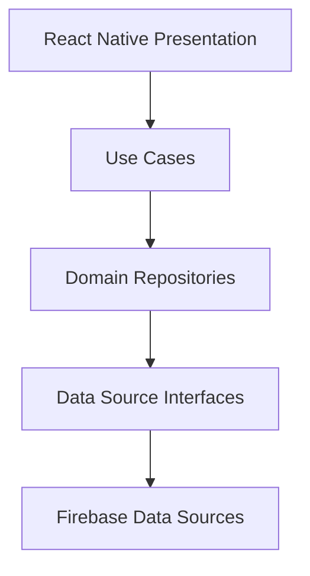

# Firebase High-Level Architecture

## Overview
This Firebase backend serves as the cloud infrastructure for the Enterprise Visitor Management System (VMS). 
Firebase is utilized purely as an implementation detail behind the `DataSource` layer inside the application's Infrastructure boundary.

## Core Services
1. **Firebase Authentication**: Handles Employee login (Admin, Host, Security). Visitors do not authenticate.
2. **Cloud Firestore**: Primary NoSQL document database storing users, visitors, visits, passes, and audit logs.
3. **Firebase Storage**: Stores binary assets like Visitor Face Photos and Government ID scans.
4. **Firebase Cloud Messaging**: Delivers push notifications for arrival, check-in, and check-out events.
5. **Firebase Hosting / Cloud Functions**: Serves the Digital Visitor Pass via secure public URLs without exposing internal Firestore collections.

## Clean Architecture Integration
The React Native mobile application strictly adheres to Clean Architecture. 

No Firebase SDKs are imported outside of `src/infrastructure/firebase/`. This allows replacing Firebase with any other cloud backend seamlessly.

## Offline First Strategy
The mobile client leverages Firestore's Offline Persistence (`localCache`) backed by a custom `SyncQueue`. This ensures the Front Desk Security app functions reliably in environments with intermittent network connectivity.
